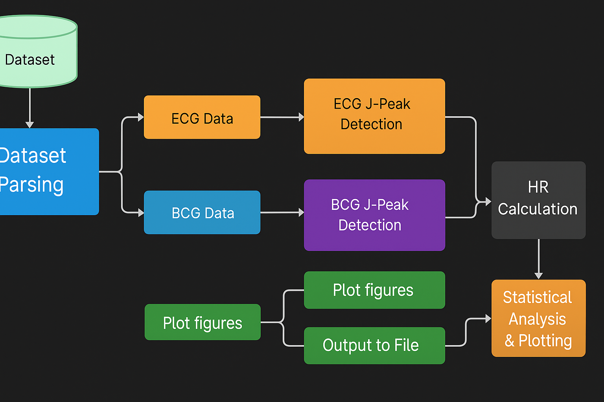

# Heart Rate Estimation from BCG using J-Peak Detection

This project processes the [Ballistocardiogram dataset with reference ECG signals](https://figshare.com/articles/dataset/A_ballistocardiogram_dataset_with_reference_sensor_signals_in_long-term_natural_sleep_environments/26013157?file=46976602) to estimate heart rate (HR) based on J-peak detection and compares the estimates with reference ECG-derived HR values.

## Workflow Overview
Below is the flowchart describing the pipeline of our analysis:


## Objective
- Detect J-peaks from BCG signals.
- Compare estimated HR with reference ECG HR.
- Evaluate results using:
  - **Mean Absolute Error (MAE)**
  - **Root Mean Square Error (RMSE)**
  - **Mean Absolute Percentage Error (MAPE)**
- Visualize results using:
  - **Bland-Altman Plot**
  - **Pearson Correlation Plot**
  - **Boxplot**

## Results
### Bland-Altman Plot
This plot compares the difference between HR estimates from BCG and ECG over the average:


### Pearson Correlation Plot
This plot shows the correlation between estimated HR from BCG signals and reference HR from ECG signals:


### Boxplot
This boxplot visualizes the distribution of HR estimates from BCG signals compared to reference ECG HR.

## How to Run
```bash
jupyter notebook code.ipynb
```
**Note: You may need to update the dataset path in the code according to your local file structure.**
## Dataset
The project uses the Ballistocardiogram dataset with reference ECG signals. Make sure to download this dataset and update the file paths in the code before running.
### Dependencies
Install the required dependencies:
```bash
pip install -r requirements.txt
